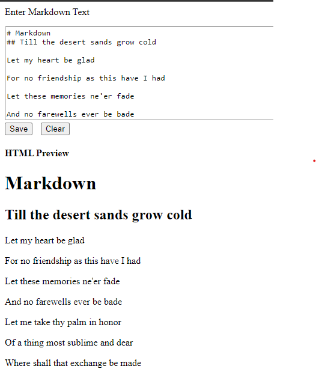

# MarkDown Engine

The MarkDown Engine app is a simple program that takes in markdown input and renders HTML as output.

The image below shows the user interface of the application with sample text.

## Image of render

## How to run the project

This project was generated with [Angular CLI](https://github.com/angular/angular-cli) version 13.1.3.

Clone the repo and run the program with the command `ng serve` for a dev server to start.

Navigate to `http://localhost:4200/`.

Write text in the textare and click **RENDER** to get a html preview of the program

## Further help on Angular

To get more help on the Angular CLI use `ng help` or go check out the [Angular CLI Overview and Command Reference](https://angular.io/cli) page.

## Credits

jfcere ngx markdown[jfcere](https://github.com/jfcere/ngx-markdown/tree/master/lib)

